# Proyecto 1: Bastionado del arranque del sistema

## Parte 1: Opciones de seguridad de la Bios

La BIOS y UEFI son componentes muy importantes de los dispositivos informáticos. El objetivo es explorar las diversas opciones de seguridad que ofrecen, como la protección por contraseña y el arranque seguro. Al bastionar el arranque de un sistema nos protegemos contra accesos sin autorización a configuraciones que pueden ser críticas en un equipo informático.

- **Contraseña de administración de la BIOS**

    La contraseña de administración de la BIOS protege la configuración del firmware del sistema haciendo que usuarios no autorizados accedan a la BIOS y modifiquen la configuración del hardware, el orden de arranque, la habilitación/deshabilitción de dispositivos y otras opciones críticas.

    En la siguiente imagen de la BIOS, seleccionamos **Set Administrator Password** y le damos a *Enter*.

    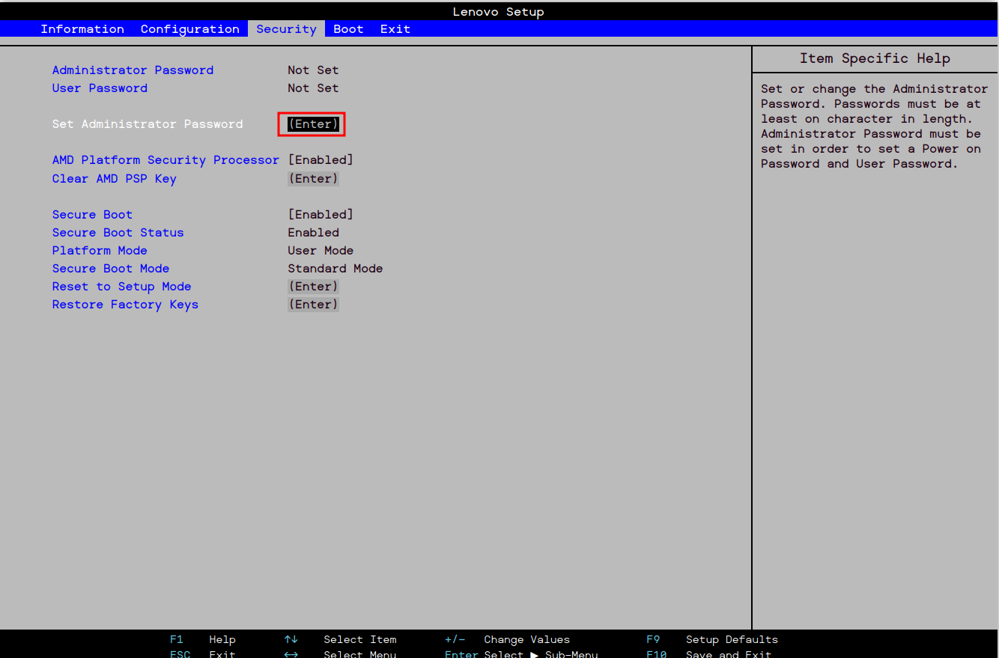

    Introducimos una contraseña y la confirmamos y ya está activada.

- **Contraseña de usuario de la BIOS**

    Es otra capa de seguridad que nos permite controlar el acceso a la configuración del sistema, aunque ésta solo permite acceder a la BIOS para ver información, sin hacer modificaciones. Esto puede sernos útil para prevenir que otros cambien configuraciones críticas.

    El mismo procedimiento será para añadir una contraseña al usuario.

    Una vez lo hagamos, nos saldrá como **Set**.

    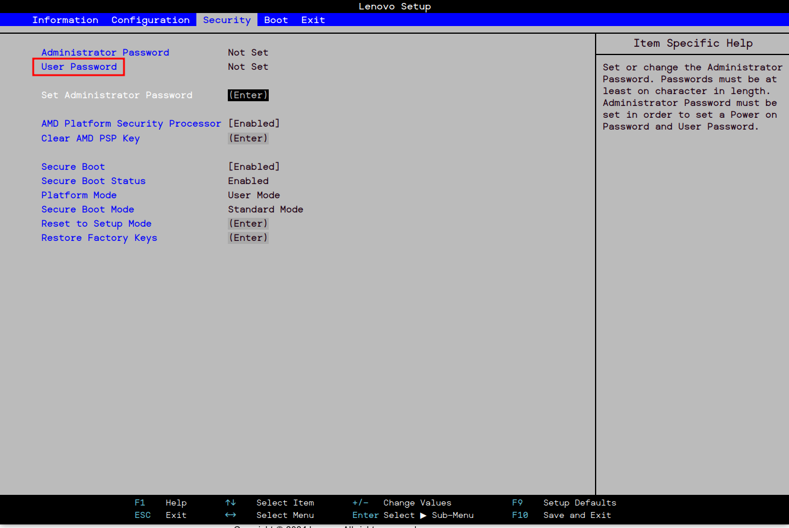
    
- **Contraseña de arranque del dispositivo**

    La contraseña Power-On o de HDD solicita una contraseña para poder arrancar el equipo.

    Nos dirigimos a la pestaña **Segurity** y le damos a *Set Hard Disk Password*.

    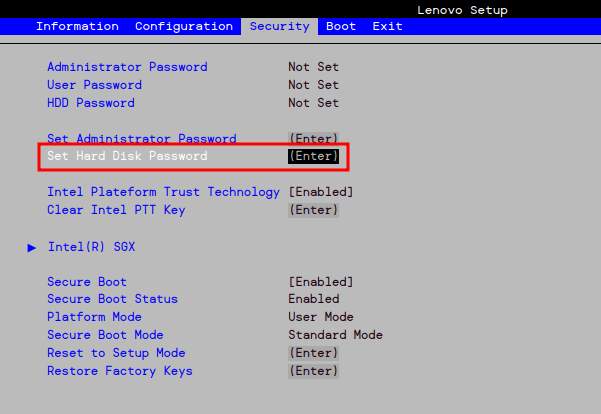

    Presionamos *Enter* y escribimos una contraseña y la confirmamos.

- **Permiso para el arranque desde dispositivos USB**

    Es una opción que nos permite o impide arrancar el sistema desde dispositivos USB o discos duros externos. Es útil para instalar sistemas operativos, realizar diagnósticos o recuperar datos.

    Sin embargo, puede poner en riesgo la seguridad del equipo, especialmente en entornos corporativos. Cualquiera podría iniciar el sistema con un USB malicioso.

    Para **deshabilitarlo**, vamos a la pestaña **Boot**.

    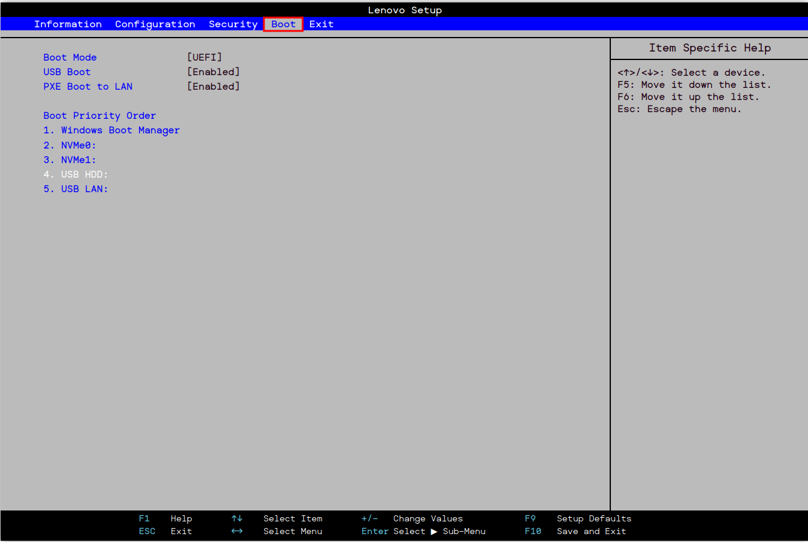

    En USB Boot, seleccionamos *Enabled* y lo dejamos como *Disabled*.

    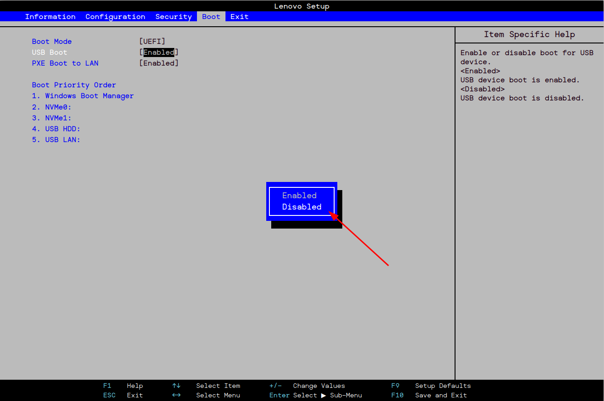

    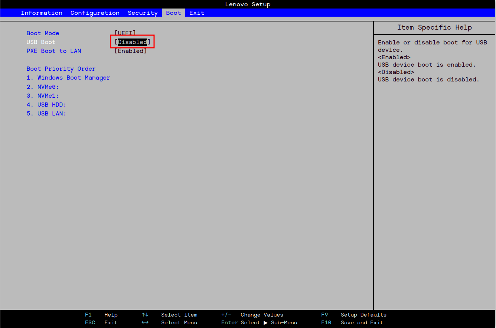

- **Orden de arranque**

    Es una configuración que determina el dispositivo desde el cual se iniciará el sistema operativo en un equipo. Si no encuentra el sistema operativo en el primero, continuará con el segundo y así sucesivamente.

    Desde la pestaña de Boot, en **Boot Priority Order**, podemos modificarlo a nuestro gusto o según necesidad.

    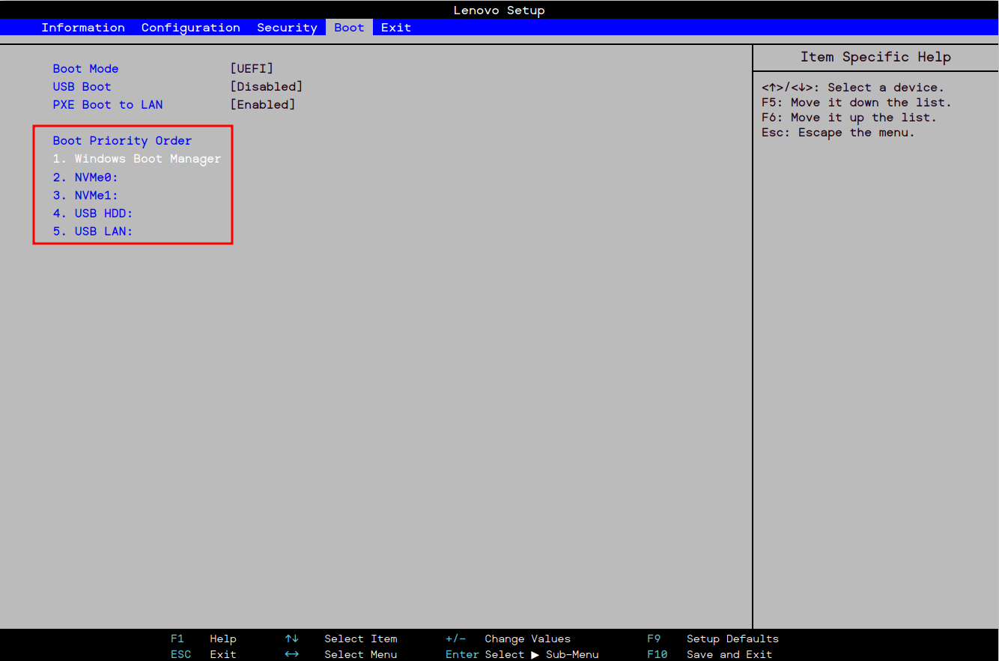

    Ahí podemos ver que la primera opción es el cargador de arranque de Windows seguido de unidades de almacenamiento SSD y un disco duro externo HDD.

- **Secure Boot**

    Es una característica que se encuentra en la mayoría de sistemas UEFI. Su propósito es proteger el proceso de arranque del sistema al asegurarse de que solo se ejecute software de arranque firmado y verificado por el fabricante.

    Utiliza una base de datos de claves y certificados de confianza. Si el software que se intenta cargar está firmado, se permite su ejecución.

    Con esto evitamos que se ejecute software no autorizado durante el arranque, Secure boot nos ayuda a proteger el sistema contra malware que intente interferir en el inicio.

    En la siguiente captura de la BIOS que estamos configurando, nos situamos en la pestaña **Security**.

    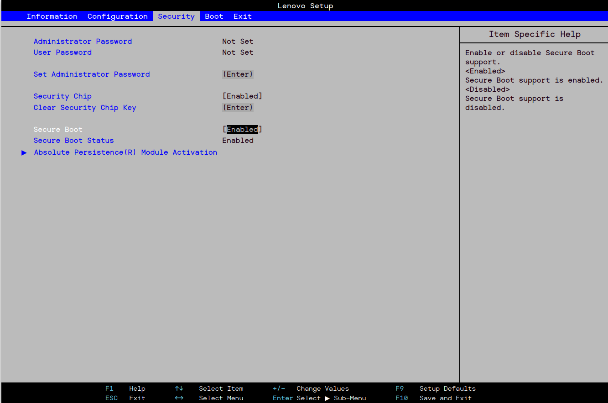

    En la opción **Secure Boot**, lo dejamos con *Enabled*.

    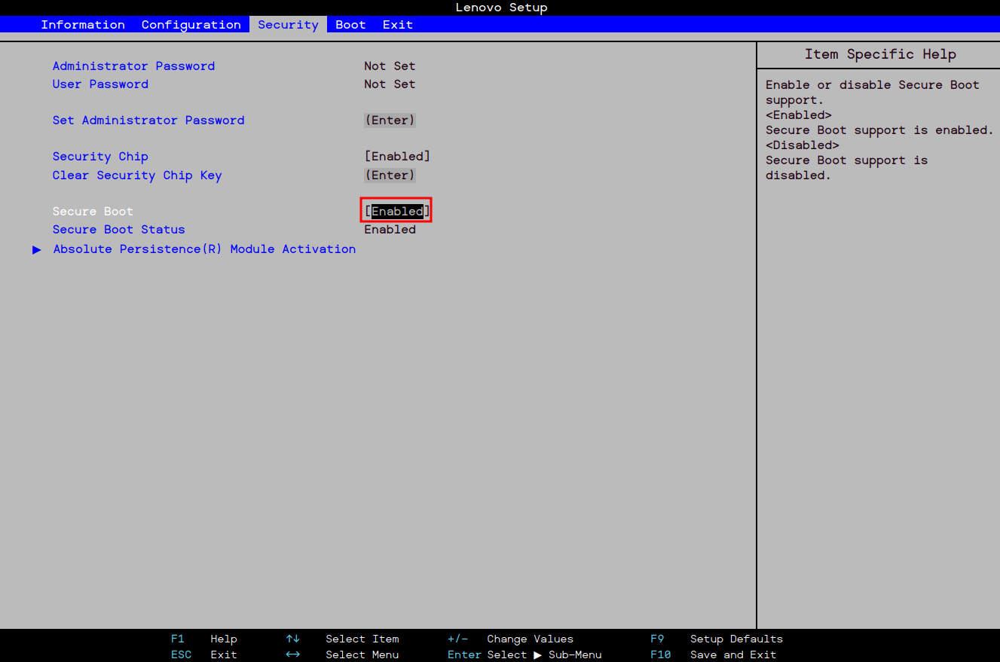

- **Intel Platform Trust Techonology (PTT)**
  
    Nos proporciona una plataforma segura que utiliza tecnologías de seguridad integradas en el procesador. Nos permite proteger los datos y las claves de encriptación.
    A diferencia de un TMP físico, PTT se ejecuta como un servicio dentro del firmware del procesador. Esto implica que es más difícil de manipular sin acceso físico al dispositivo, además de que puede
    beneficiarse de actualizaciones del firmware para corregir posibles vulnerabilidades.

    En la pestaña de **Security**, nos situamos en **Intel Plateform Trust Technology**.

    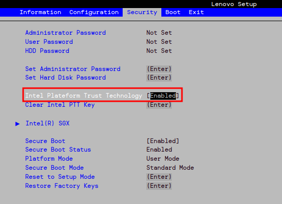

    Está habilitada por defecto, pero presionando *Enter* y seleccionando *Enabled* ya lo activamos.

    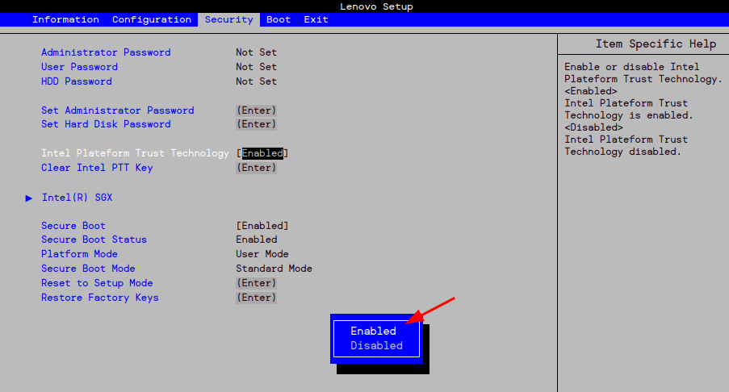

Finalmente, para guardar todas estas configuraciones que hemos hecho para bastionar el arranque de nuestro sistema, vamos a la pestaña **Exit**.

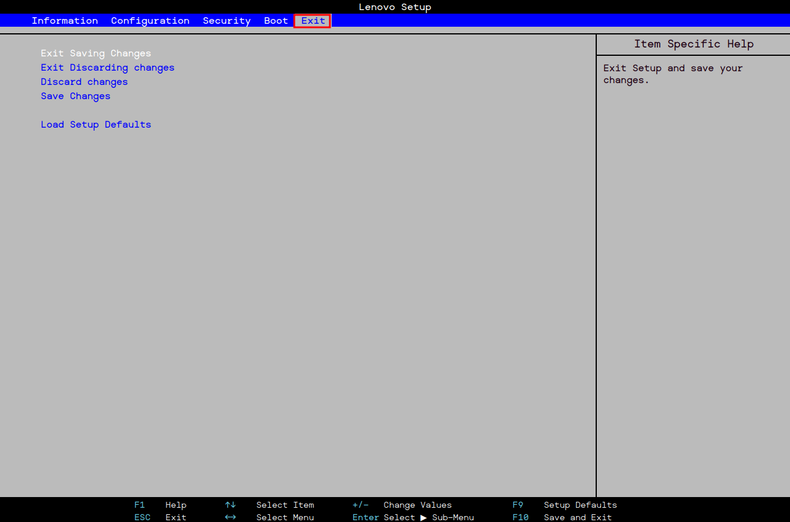

Presionamos *Enter* en **Exit Saving Changes** y aceptamos.

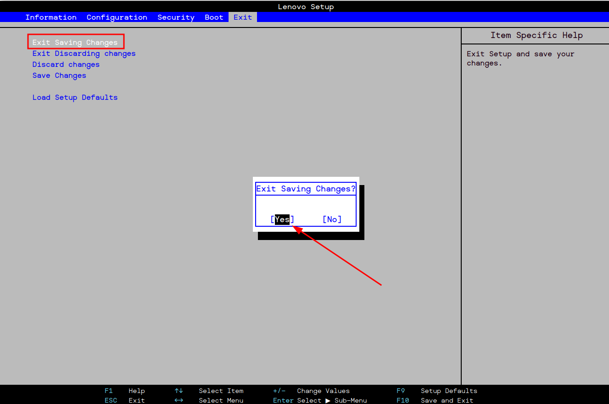
